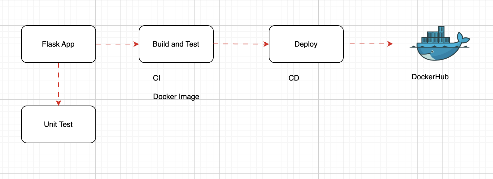

# automate_mlops
Automating Workflow of CI &amp; CD for Docker Image of Flask App Using Github Action




----
Once we push the Image to DockerHub, we can verify it.

Now we can download it and run the DOcker Image in a container.

```bash
docker pull dockermayanktripathi/flask-app

docker run -p 5001:5001 dockermayanktripathi/flask-app:latest
```

